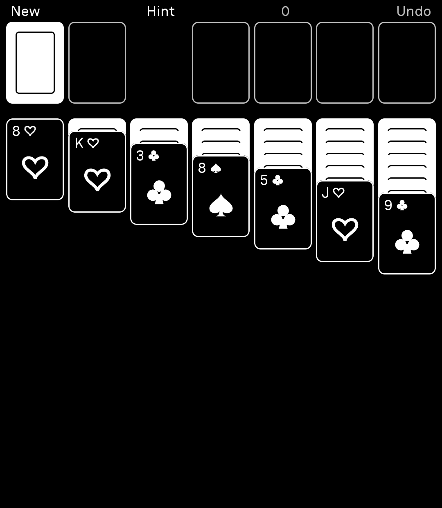

# BrightSolitaire

Solitaire for the Light Phone III. **Klondike**, draw one with unlimited redeals, and
**Yukon**, where the whole pack is on the table from the first move. A LightOS tool
built on the official [light-sdk](https://github.com/lightphone/light-sdk) with Kotlin,
Jetpack Compose, `LightScreen` and `LightViewModel`, themed with `sdk:ui`.

## Install via BrightMarket

<p align="center">
  
</p>

Scan the code above with **BrightMarket** installed to open BrightSolitaire there and
install or update it directly. Don't have BrightMarket yet? Get it, and browse
every Bright app, at
**[gi-os.github.io/brightmarket-index/browse.html](https://gi-os.github.io/brightmarket-index/browse.html)**.

[Download the latest APK](https://github.com/gi-os/BrightSolitaire/releases/latest). See
[INSTALL.md](INSTALL.md).

Part of the [gi-os Light App collection](#the-gi-os-light-app-collection).

## Two games

Both are dealt onto the same seven columns into the same four foundations, and the
foundations work the same way: aces up, by suit. Everything else about them differs, and
each difference is asked for by name in the code rather than guessed at from the shape of
the board.

| | Klondike | Yukon |
| --- | --- | --- |
| Dealt face down | 21 | 21 |
| Dealt face up | 7 | 31 |
| Stock | 24 cards, draw one, unlimited redeals | none — the pack is all on the table |
| What you can pick up | a run: descending, alternating colours | **any face up card, and whatever sits on it** |
| Empty column | a king | a king |

That one rule in bold is the whole of Yukon. You move a card by carrying everything piled
on top of it, so what you drag is usually nonsense and the reason to drag it is the card
it uncovers. Nothing is hidden but the twenty-one cards under the columns, and there is
no stock to shuffle through when you are stuck, so every deal is a position rather than a
hand you are dealt into.

**New** in the top bar asks which one. That tap is not free, and it is there anyway:
dealing throws away the board you are on either way, and naming the game is the one place
both can be reached from without spending a control in a bar four items wide.

## Reading a one-bit deck

The panel is black and white, so shape carries the suit color instead of hue.

- The app draws spades and clubs filled.
- It draws hearts and diamonds as outlines.

The alternating-color rule stays readable at a glance and needs no legend. A card face
uses the theme background with a hairline border. A card back is solid `content` with an
inset frame, so a face-down pile reads as a dark block from across the table. The whole
thing follows the LightOS theme and flips with light and dark mode.

## Controls

| Action | What happens |
| --- | --- |
| Tap a card | It goes to a foundation if it fits, otherwise to the leftmost legal column |
| Tap a face-down card | It turns over, if it sits at the bottom of its column |
| Tap the stock | Draw one. Tap the empty ring to redeal the waste. Klondike only — Yukon draws no stock or waste slot at all, rather than two outlines that never do anything. |
| Drag | Manual placement, including a multi-card run, or pulling a card back off a foundation |
| Hint | Suggests a move. Tap again for the next one. |
| Finish | Plays the rest of the game. Appears once no card is face down. |
| New, Undo | Top bar. New asks which game. Undo remembers 120 moves. |

The number in the middle of the top bar is the move count. It is the same number the win
screen reports.

Tapping a foundation does nothing on purpose, so you cannot unstack a suit you already
banked. Auto-move also refuses to shuffle a lone king between two empty columns, which
would only burn a move.

A tapped card travels to where it lands. The move takes 170 ms, which is long enough to
show you where the card went and short enough to stay out of the way. A drag does not
animate, because your finger already did.

Win, and the cards waterfall off the foundations: they arc out, bounce along the bottom
and slide off the sides, painting trails as they go. Tap to cut it short. Behind it the
screen reads **You win**, your move count, and **Deal again**. The trails come
from an offscreen bitmap that the app draws into once a frame and never clears, so the
cost per frame is the few cards in the air rather than every position they have held.

The physics carry no drawing code, which lets a unit test step the whole cascade and
assert that it always ends. An animation that ran forever would leave the win screen
unreachable, so the test checks it at five different frame rates, and on a board one dp
across.

The game saves to the tool DataStore after every move and on pause, so leaving and
coming back drops you on the same board. The app throws away a save that does not
decode to a legal 52-card deal, and deals you a fresh game instead of a corrupt one.

Layout measures from the real screen size rather than a hardcoded number, so it survives
an emulator at another resolution. On an LP3, with about 411 x 472 dp of usable space,
that works out to a 53 dp card. A long column compresses its fan spacing instead of
running off the bottom, and the bottom 44 dp stays clear for the LightOS back button.

## Finish

Once no card on the table is face down there is nothing left to find out. In Klondike
what remains is almost always clerical — bank the aces, bank the twos, keep going — and
making somebody tap fifty times through a foregone conclusion is not a game. So at that
point, and not before, the top bar offers **Finish**.

It only ever plays a line it has already found in full. A finish that ran out halfway,
having rearranged the board on the way, would be worse than being told it could not be
done — so when there is no line the board is not touched at all, and the message says
**No quick finish from here**. That is deliberately not the same sentence as *This deal
can't be won*: the search behind Finish is capped and gives up early, and the only thing
that ever claims a deal is lost is the proof described below.

Two attempts, cheapest first. A sweep that plays cards to the foundations and nothing
else, lowest rank first, drawing through the stock when the table has nothing to give.
Above its face down cards a Klondike column is always a run, so a Klondike board with
nothing left face down is seven runs with their lowest cards at the bottom — which is
exactly the shape the sweep walks straight through. Measured over sixty such boards it
finished every one, in 62 moves on average, in ten milliseconds.

Yukon does not come apart that neatly, so it falls back to a depth limited search: 220
moves at most, foundations tried first, never taking a card back off a foundation. Over
forty revealed Yukon boards it found a win every time, 129 moves on average. The cap is
not really about search cost — you watch every one of those moves go past, and a line
long enough to want skipping was not worth offering. A tap during the cascade takes the
rest at once.

The search is a separate thing from the one below and wants a different answer. That one
asks whether a win exists at all and will follow a four thousand move path to prove that
one does. Here a four thousand move path is no answer, because the line gets played out
in front of somebody.

## Hints, and when a deal is dead

A hint draws the card to move inverted, and puts a heavier outline on the square it goes
to. The app ranks suggestions: bank a card if it can, otherwise uncover a face-down card,
otherwise empty a column, otherwise play off the waste. Tap Hint again for the next one.
It never suggests taking a card back off a foundation. It suggests a draw when the table
really has nothing.

Two different messages can appear at the bottom of the board. The difference matters.

**No moves left** is exact and immediate. The app checks the table, then walks every card
in the stock for anything playable. When it shows this, the deal is over. Undo, or deal
again.

**This deal can't be won** is a proof, and it appears only when the proof is cheap. Hint
also starts a search in the background. The search walks positions you can still reach,
and keys each one so that no two positions can be confused for each other. If it runs out
of positions before it runs out of budget, then it visited every position you can reach
and none of them wins. The deal is lost.

While that search runs, the board shows **Checking**. If the search hits the budget first,
the message clears and the app claims nothing.

Both games are hard to solve in general, so an honest tool has to be able to shrug. This
message lands on a board that is nearly dead, where little space is left. A fresh deal
that happens to be unwinnable usually gets no flag, because the proof would cost more
time than a phone should spend. The app never claims a deal is lost when it is not.

## Screenshots

<p align="center">
  <br>
  <sub>A fresh deal, zero moves. Filled pips are spades and clubs, outlined are hearts and diamonds.</sub>
</p>

Taken on a Light Phone III.

## Layout of this repository

This is the light-sdk tree. The game lives in the `tool/` module that the SDK reserves
for exactly that. Everything else stays upstream and untouched, so a rebase stays
cheap.

| Path | What it is |
| --- | --- |
| `tool/src/main/kotlin/com/thelightphone/solitaire/Game.kt` | Every rule. Immutable `Game`, no Android imports. |
| `tool/src/main/kotlin/com/thelightphone/solitaire/Variant.kt` | The three places Klondike and Yukon differ, and nothing else |
| `tool/src/main/kotlin/com/thelightphone/solitaire/Finish.kt` | Playing out a game that is already decided |
| `tool/src/main/kotlin/com/thelightphone/solitaire/Moves.kt` | Moves as data: the generator, hint ranking, the dead-end check |
| `tool/src/main/kotlin/com/thelightphone/solitaire/Solver.kt` | Can this still be won? Winnable, unwinnable, or unknown. |
| `tool/src/main/kotlin/com/thelightphone/solitaire/Victory.kt` | Waterfall physics. Numbers only, no drawing. |
| `tool/src/main/kotlin/com/thelightphone/solitaire/VictoryLayer.kt` | Draws the waterfall into an accumulating bitmap |
| `tool/src/main/kotlin/com/thelightphone/solitaire/Cards.kt` | Suits, cards, seeded deck |
| `tool/src/main/kotlin/com/thelightphone/solitaire/CardView.kt` | Canvas suit glyphs, card face, card back |
| `tool/src/main/kotlin/com/thelightphone/solitaire/HomeScreen.kt` | `@InitialScreen`, view model, table geometry, tap and drag |
| `tool/src/main/kotlin/com/thelightphone/solitaire/SaveState.kt` | One-line text encoding of a deal |
| `tool/src/main/kotlin/com/thelightphone/solitaire/SolitaireStore.kt` | DataStore read and write |
| `tool/src/test/kotlin/com/thelightphone/solitaire/` | JVM unit tests, which CI runs before it builds anything |
| `tool/lighttool.toml` | Tool identity and version. The release workflow checks the tag against it. |
| `tool/src/main/res/drawable/loading_text_icon.xml` | The mark, which overrides the SDK splash drawable of the same name |
| `tool/src/main/res/mipmap-*/ic_launcher.*` | Launcher icon: adaptive for Android, PNG for tooling |
| `tool/src/{debug,release}/AndroidManifest.xml` | Declares the launcher icon the generated manifest omits |
| `tools/generate_icon.py` | Builds the mark, the launcher icon and `assets/icon.png` from Public Sans |
| `sdk/`, `plugin/`, `examples/`, `docs/` | Upstream light-sdk |

## Build

```sh
git clone https://github.com/gi-os/BrightSolitaire.git
cd BrightSolitaire
./gradlew :tool:testDebugUnitTest :tool:assembleDebug
```

This repo vendors the SDK, so the build resolves nothing from GitHub Packages.

To run against the LightOS emulator, set
`serverPackage = "com.thelightphone.sdk.emulator"` in `tool/lighttool.toml`. Set it back
to `com.lightos` before a device build.

## The mark

LightOS has no launcher icon. The toolbox lists tools by name, nothing in the SDK or the
emulator ever calls `loadIcon`, and the SDK generates the manifest itself with no
`android:icon` in it. A hand-written `src/main/AndroidManifest.xml` is a deliberate build
error, so there is no hook to add one.

The splash is the one place a tool can show a mark of its own. `sdk:client` ships a
drawable named `loading_text_icon`, the "loading..." wordmark. Resources in the
application module take precedence over resources from a library module, so
`tool/src/main/res/drawable/loading_text_icon.xml` replaces it with no manifest change and
no rule bent.

The mark is a white capital S on black, in Public Sans, matching how FogLight draws the
first letter of its name in `scripts/generate-icon.js`. `tools/generate_icon.py` pulls the
real glyph outline out of the font, so the drawable is a true vector rather than a trace,
and writes `assets/icon.png` for this page at the same time.

The same mark is also a real launcher icon, declared from a build-type manifest rather
than `src/main`, which is ordinary manifest merging and leaves the SDK's generated
manifest alone. The LightOS toolbox still shows only the name, so this is what `adb`,
system settings, Obtainium and any other launcher display. Light's build pipeline uses
the upstream plugin and would simply not pick the manifest up, which is fine.

It ships as an adaptive icon in `mipmap-anydpi-v26`, with the letter at 62% of the 72 dp
safe square so no launcher mask can clip it, **and** as flat PNGs at the five densities.
Android never reads the PNGs, because minSdk 34 means the `anydpi-v26` folder always
wins. They are there for everything that reads an APK without applying resource
qualifiers, which is most tooling. An icon that exists only as vector XML comes back
blank in those: they find the reference, cannot rasterise it, and give up.

One thing worth knowing if you track this in Obtainium: it takes the icon from the
**installed** package, through `PackageManager`, and caches it. It cannot show an icon
for a version you have not installed, and no release asset changes that. After updating,
open the app's page in Obtainium once; that path re-reads the icon and ignores the cache.

```sh
python3 tools/generate_icon.py path/to/PublicSans-Regular.ttf
```

## Tests

The rules carry no Android dependency, so all of this runs as a JVM unit test. CI builds
no APK until it passes.

`KlondikeTest` covers the deal, the stock cycle and redeal order, what a foundation and a
column accept, run validity, what you can pick up, and win detection. It then plays 200
deals with a greedy policy. After every single position it asserts that all 52 cards are
present, that none repeats, that each foundation climbs in one suit, that no face-down
card sits above a face-up one, and that every face-up run descends in alternating colors.

`YukonTest` covers the three differences — the deal, that any face up group moves as one
and that there is no stock — and then re-runs the shared machinery over Yukon boards:
every offered move can be played, a tap and the move it reports agree, and 200 deals stay
consistent through a greedy playout. Anything that quietly assumed the other game shows
up there rather than on a phone.

`FinishTest` replays every line the finish button hands back and insists the board is won
at the bottom of it, over sixty revealed Klondike boards and forty revealed Yukon ones. It
also checks the line never exceeds the cap, never takes a card back off a foundation, and
never draws in a game with no stock. Building the Klondike boards is the interesting part:
above its face down cards a Klondike column is always a run, so a revealed board is seven
runs — and the round-robin deal it is tempting to write instead is a position no game of
Klondike can reach, which is why an earlier version of this test said the finish never
worked.

`SaveStateTest` round-trips a fresh board, a board in progress and a finished one, in both
games, and checks which game it was comes back with it. A truncated, duplicated,
wrong-version or otherwise damaged save must decode to nothing rather than to a broken
game. A save written before Yukon existed still reads, as Klondike: the version 1 format
had no game field because there was only one game, and dropping those lines would end
somebody's board to save a branch.

`MovesTest` asserts that the app can play every move it offers, and that a tap and the
move it reports are the same move. The animation would lie otherwise.

`VictoryTest` steps the waterfall to the end at 15, 30, 60, 90 and 120 frames a second, and
on a one dp board, and asserts every run finishes inside the patience limit. It also checks
that all 52 cards launch exactly once, that none falls through the bottom or reaches an
infinite coordinate, and that cards leave in both directions.

`SolverTest` guards the unwinnable claim. The state key must be one to one: a collision
would drop a branch that wins and still let the search report that it looked everywhere.
The test asserts distinct keys across 400 deals, and that the key ignores the move
counter. It then cross-checks the verdict against a second, independent search. That one
goes breadth first instead of depth first, keys on `SaveState` instead of the solver key,
and explores the whole space instead of stopping at the first win. A full deal is too
large to walk, so both searches run over cut-down decks of a few suits and a few ranks,
where finishing is possible. About 150 positions get compared on each run, near two
thirds winnable and one third not, and the two searches must agree on every one. Each
winnable verdict then has its line replayed move by move, and the line must end in a win.

## Origin and credits

- **[lightphone/light-sdk](https://github.com/lightphone/light-sdk)** by The Light Phone
  is the base of this repository. This repo vendors the whole tree. The SDK client, the UI kit, the Gradle
  plugin, the lint rules and the builder are their work, released under MIT before the
  platform was even public. Thank you.
- **[gi-os/BrightTransit](https://github.com/gi-os/BrightTransit)** set the repository
  pattern this one copies. Fork light-sdk, write the tool into the module the SDK
  reserves for it, leave upstream alone, and let a workflow build the APK against a
  version check.
- Klondike and Yukon both belong to nobody. Klondike here is the standard draw-one variant
  with unlimited redeals; Yukon is the standard deal of one, six, seven, eight, nine, ten
  and eleven cards with five face up in every column but the first.

## The gi-os Light App collection

Twelve tools for the Light Phone III, all open source, all built in one run.

| Tool | What it does | Built on |
| --- | --- | --- |
| [BrightPasses](https://github.com/gi-os/BrightPasses) | Photograph a movie ticket, keep the stub | Plain Android |
| [LightQR](https://github.com/gi-os/LightQR) | QR scanner, plus a browser generator | Plain Android |
| [BrightNews](https://github.com/gi-os/BrightNews) | RSS and Atom reader with images and QR subscribe | light-sdk, fork of [zachattack323/LightRSS](https://github.com/zachattack323/LightRSS) |
| [BrightTransit](https://github.com/gi-os/BrightTransit) | Live MTA subway arrivals | light-sdk fork |
| [chat](https://github.com/gi-os/chat) | iMessage over a self-hosted BlueBubbles server | Fork of [craigeley/chat](https://github.com/craigeley/chat) |
| [FogLight](https://github.com/gi-os/FogLight) | Fog of World companion, GPS recorder and fog map | Fork of [garado/light-topographic](https://github.com/garado/light-topographic) |
| [BrightNonogram](https://github.com/gi-os/BrightNonogram) | Picross, plus a generator that only ships solvable puzzles | Kotlin generator, light-sdk tool |
| **BrightSolitaire** (this repo) | Klondike and Yukon, with a solver that finishes a decided game | light-sdk |
| [BrightLibrary](https://github.com/gi-os/BrightLibrary) | RSVP speed reader for EPUB and MOBI | Fork of [fluffyspace/FastRead](https://github.com/fluffyspace/FastRead) |
| [BrightTip](https://github.com/gi-os/BrightTip) | Tip calculator, plus a receipt splitter that reads the line items | Plain Android |
| [BrightNoise](https://github.com/gi-os/BrightNoise) | Twelve synthesized sounds, a two-layer mixer and a sleep timer | Plain Android |
| [LightPods](https://github.com/gi-os/LightPods) | AirPods battery, in-ear and lid status | Plain Android, ports [LibrePods](https://github.com/kavishdevar/librepods) |

The Light Phone does not sponsor or endorse any of these. Licences vary per repo.

## License

MIT, the same as upstream light-sdk. See [LICENSE](LICENSE).
